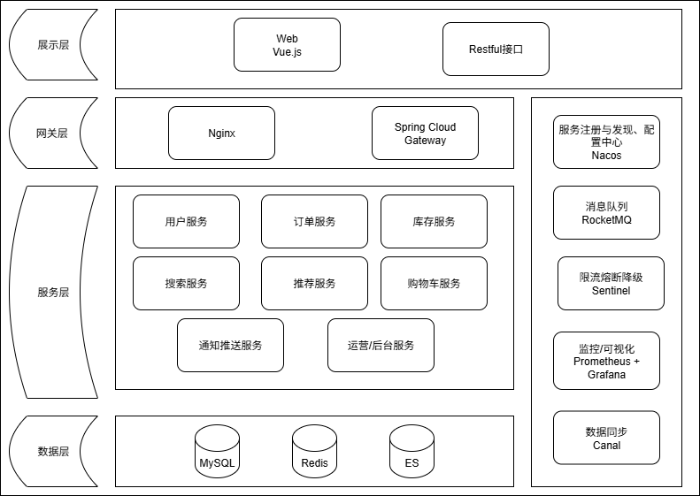
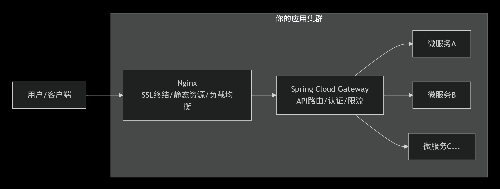

# 设计文档

## 总体架构设计

### Nginx与Gateway

#### 基本介绍

Nginx：

- 主要职责：流量分发，静态资源服务、SSL终结
- 用于反向代理、负载均衡、托管静态文件、管理SSL等。
- 静态配置，通常写入文件。

Gateway：

- 主要职责：API路由、聚合、认证
- 用于根据请求路径路由到不同服务，验证JWT，聚合API等.贴近业务 
- 动态配置，与服务发现（Nacos）结合

#### 工作流程

#### 选型上

**Spring Cloud Gateway**由Java写的，基于Spring生态，无缝集成，功能全面，异步非阻塞.

## 开发环境

- Java版本：17
- SpringBoot：3.0.2
- Nacos：3.1.0

